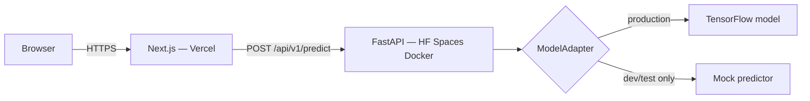

# Oral Disease AI Classifier

An educational web application that classifies oral/dental images with a deep-learning model: upload an image, get the predicted class, confidence score, and full probability distribution through a clean, clinically responsible interface.

> [!WARNING]
> **Educational and research use only.** This system is not a medical device and is not a substitute for professional medical advice, diagnosis, or treatment.

## Architecture

- **`apps/web`** — Next.js (App Router, TypeScript strict, Tailwind CSS v4), the *Arcus* UI. Deployed to Vercel.
- **`apps/api`** — FastAPI (Python 3.12) with a framework-agnostic model adapter layer. Deployed to Hugging Face Spaces (Docker).
- **`model/`** — the trained **ResNet50V2** (`oral_disease_resnet50v2_deployment.keras`) plus `class_config.json`, which is the single source of truth for class labels, input size, and preprocessing. Weights are never committed.
- **No database** — images are validated and processed entirely in memory, never stored. See `docs/DECISIONS/001-no-database.md`.



## Quick start (development, mock mode)

Prerequisites: Python 3.12+, Node.js 22+, npm.

```powershell
# Backend
cd apps/api
python -m venv .venv
.venv\Scripts\activate
pip install -r requirements.txt -r requirements-dev.txt
uvicorn app.main:app --reload --port 8000

# Frontend (second terminal)
cd apps/web
npm install
npm run dev
```

Open http://localhost:3000. Without a real model the API runs in **mock mode** (development only, clearly labeled in the UI — never real predictions).

Or with Docker: `docker compose up --build`.

## Integrating the real model

The ML work (custom CNN, pretrained models, tuning, evaluation) happens outside this repo. When the final Keras model is ready, follow **[model/README.md](model/README.md)** — no frontend or API changes are required.

## Project layout

| Path | Purpose |
|---|---|
| `apps/web` | Next.js frontend |
| `apps/api` | FastAPI backend + adapter layer |
| `model/` | Final model drop-in (gitignored) |
| `docs/` | Architecture, API contract, design system, security, testing, deployment |
| `e2e/` | Playwright end-to-end tests |
| `skills/` | Project Claude Code skills + sources record |
| `scripts/` | Dev helper scripts |

## Testing

```powershell
cd apps/api; pytest                 # backend
cd apps/web; npm test               # frontend
cd e2e; npx playwright test         # end-to-end
```

See [docs/TESTING.md](docs/TESTING.md).

## Documentation

Start with [docs/ARCHITECTURE.md](docs/ARCHITECTURE.md) · [docs/API_CONTRACT.md](docs/API_CONTRACT.md) · [docs/MODEL_INTEGRATION.md](docs/MODEL_INTEGRATION.md) · [docs/DEPLOYMENT.md](docs/DEPLOYMENT.md) · [docs/SECURITY_AND_PRIVACY.md](docs/SECURITY_AND_PRIVACY.md)

## Privacy

Uploaded images are processed in memory and discarded immediately after classification. No images, no analytics, no trackers. Details: [docs/SECURITY_AND_PRIVACY.md](docs/SECURITY_AND_PRIVACY.md).
