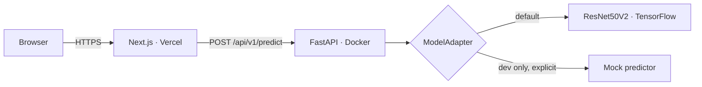

<div align="center">

# ◠ Arcus

**Oral Diseases Image Classification**

Upload an oral image, and a trained ResNet50V2 tells you what it predicts, how confident it is, and the probability it assigned to *every* class it knows.

[](apps/web)
[](apps/api)
[](model/README.md)
[](LICENSE)

</div>

> [!WARNING]
> **Arcus is not a medical device.** It provides an AI classification result and is not a substitute for professional medical advice, diagnosis, or treatment. Its output is **never a diagnosis**. If you have concerns about your oral health, consult a dentist or physician.

---

## Live demo

| | |
|---|---|
| **Web app** | _Coming soon_ |
| **API** | _Coming soon_ |

Not deployed yet. Run it locally in two commands — see [Quick start](#quick-start).

## Screenshots

> Screenshots are captured from the running app with the real model. The sample images used for testing are held-out clinical photographs and are **not** included in this repository.

| Analyzer | Result | Report |
|---|---|---|
| The instrument on arrival: drop an image on the viewing surface. | Predicted class, confidence, and the full six-class distribution. | A full report, downloadable as PDF. |

## What it does

- **Classifies oral images** into six conditions using a fine-tuned ResNet50V2.
- **Shows the whole distribution**, not just the winner — the probability of every class, always.
- **Refuses to overstate certainty.** Confidence is rounded *down* (a 99.9% result displays as 99%, never 100%), and vanishingly small probabilities render as `<0.1%` rather than a misleading `0.0%`.
- **Downloadable PDF report**, generated entirely in your browser.
- **Route-level page transitions** and a dedicated [About](apps/web/src/app/about) page.
- **Processes images in memory and discards them.** No storage, no database, no analytics.

## The model

| | |
|---|---|
| Architecture | **ResNet50V2** (fine-tuned) |
| Framework | TensorFlow 2.21 · Keras 3.13 |
| Input | 224×224 RGB |
| Preprocessing | **Built into the model** — it carries its own `Rescaling(1/127.5, offset=-1)` layer, so the service feeds it raw 0–255 pixels and never normalizes twice |
| Head | `Dense(6, softmax)` — the output is already a probability distribution, so the service validates it rather than applying a softmax |
| Classes | Calculus · Caries · Gingivitis · Hypodontia · Mouth Ulcer · Tooth Discoloration |

Class names, input size, and the pixel range are read from `model/class_config.json` at startup — **nothing about the model is hardcoded** in the frontend or the API. Details: [docs/MODEL_INTEGRATION.md](docs/MODEL_INTEGRATION.md).

> [!NOTE]
> No accuracy or performance metrics are published here. The model's evaluation is the author's own work and is not reproduced in this README; nothing in this repository should be read as a claim about clinical performance.

## Architecture



Two services and a frozen JSON contract. The model loads **once** at startup behind a framework-agnostic adapter, and inference runs in a threadpool so a ~0.5s CPU prediction never blocks the event loop. The real model is the **default**; a mock predictor exists for development, is **refused in production**, and is always visibly labeled when it runs.

More: [docs/ARCHITECTURE.md](docs/ARCHITECTURE.md) · [docs/API_CONTRACT.md](docs/API_CONTRACT.md)

## Tech stack

| Layer | Choice |
|---|---|
| Frontend | Next.js (App Router) · TypeScript (strict) · Tailwind CSS |
| Backend | FastAPI · Python 3.12 · Pydantic |
| Model runtime | TensorFlow · Keras 3 |
| PDF | jsPDF (lazy-loaded, client-side only) |
| Packaging | Docker · docker compose |
| Testing | pytest · Vitest · Playwright · axe |

No database. See [docs/DECISIONS/001-no-database.md](docs/DECISIONS/001-no-database.md).

## Repository structure

```text
apps/
  web/          Next.js frontend (the "Arcus" UI)
  api/          FastAPI backend + model adapter layer
model/          class_config.json + the trained .keras (weights are NOT committed)
docs/           architecture, API contract, model integration, deployment, security, testing
e2e/            Playwright end-to-end tests
```

## Quick start

Prerequisites: Python 3.12+, Node.js 22+, and the trained model in `model/` (see [model/README.md](model/README.md)).

```bash
# Backend — real model by default
cd apps/api
python -m venv .venv && .venv/Scripts/activate    # macOS/Linux: source .venv/bin/activate
pip install -r requirements.txt -r requirements-dev.txt
pip install -r requirements-tf.txt                # TensorFlow, for the real model
uvicorn app.main:app --port 8000

# Frontend (second terminal)
cd apps/web
npm install
npm run dev                                       # http://localhost:3000
```

Without the model files, the API starts in **mock mode** in development (clearly labeled in the UI, and impossible in production).

### Docker

```bash
docker compose up --build
# web http://localhost:3000 · api http://localhost:8000 · API docs :8000/docs
```

The model directory is mounted **read-only**; the weights are never baked into an image.

## Environment variables

Copy `.env.example`. The important ones:

| Variable | Default | Purpose |
|---|---|---|
| `APP_ENV` | `development` | `development` · `test` · `production` |
| `MODEL_MODE` | `auto` | `real` · `mock` · `auto` (real when the model files exist) |
| `MODEL_DIR` | `model/` | Where the model and its config live |
| `MODEL_PATH` | `oral_disease_resnet50v2_deployment.keras` | Filename inside `MODEL_DIR` |
| `MODEL_CONFIG_PATH` | `class_config.json` | Filename inside `MODEL_DIR` |
| `MODEL_VERSION` | `1.0.0` | Reported by the API |
| `CORS_ORIGINS` | `http://localhost:3000` | Allowlist. Wildcards are **rejected** in production |
| `NEXT_PUBLIC_API_URL` | `http://localhost:8000` | Frontend → API |

## Testing

```bash
cd apps/api && pytest          # fast suite, no TensorFlow required
cd apps/api && pytest -m real_model   # loads the real model
cd apps/web && npm test               # Vitest
cd e2e && npx playwright test         # end-to-end, incl. axe accessibility scans
```

The end-to-end suite runs across desktop, tablet, and mobile viewports and asserts **zero serious or critical** accessibility violations. Details: [docs/TESTING.md](docs/TESTING.md).

## Privacy & security

- Images are **processed in memory and discarded**. They are never written to disk, stored, or logged.
- The **PDF report is generated entirely in your browser** — the image is not re-uploaded to produce it, and EXIF metadata is stripped in the process.
- No analytics, no trackers, no third-party scripts.
- Strict upload validation (type, size, integrity, dimensions, decompression-bomb guards); errors never expose paths or internals.

Full detail: [docs/SECURITY_AND_PRIVACY.md](docs/SECURITY_AND_PRIVACY.md)

## Limitations

- The model can only choose among the six classes it was trained on. Anything outside that set — including images that aren't oral photographs at all — will be **forced into the nearest known class**.
- Confidence is *not* correctness: it reflects how similar an image looked to the training examples.
- The model sees pixels only. It has no symptoms, no history, no clinical context.

## Deployment

Planned: **Vercel** for the frontend, **Hugging Face Spaces** (Docker) for the API and model — a ~350 MB model plus TensorFlow needs real memory and must not run in a serverless function. Nothing is deployed yet. See [docs/DEPLOYMENT.md](docs/DEPLOYMENT.md).

## Project status

The application is complete and verified: the real model is integrated and is the default inference path, and the frontend, API, Docker setup, and test suites all pass. Deployment is the remaining step.

## Author

**Essam Ahmed** — academic deep-learning project.

## License

MIT — see [LICENSE](LICENSE).
