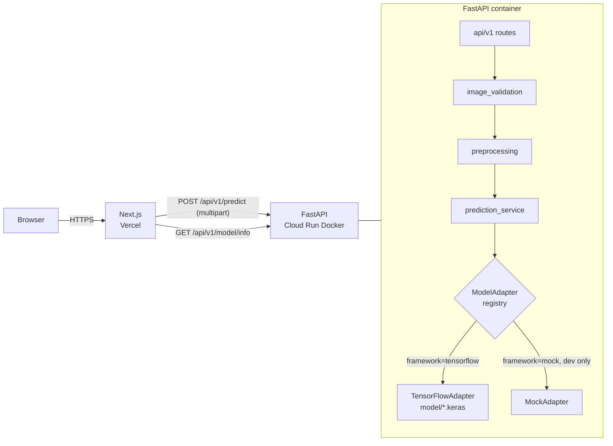
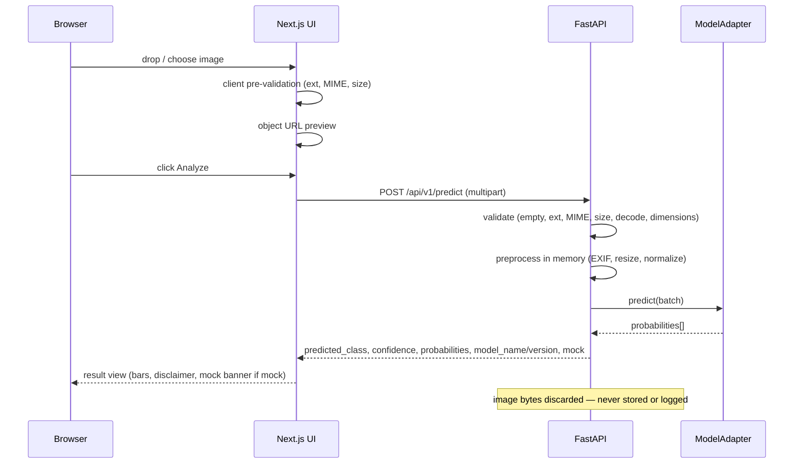
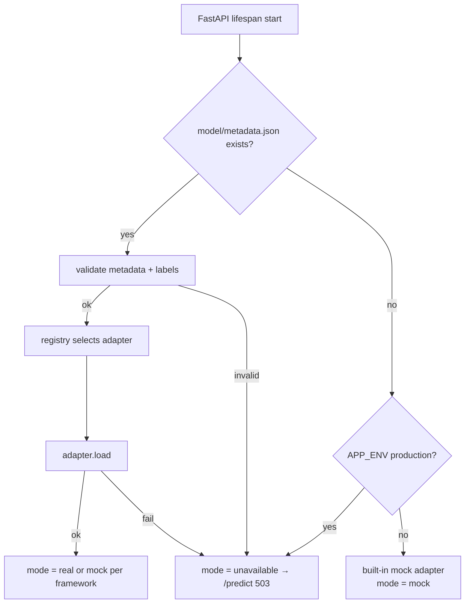
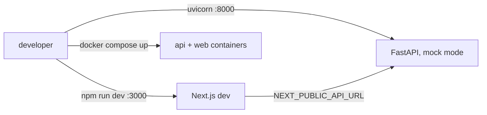
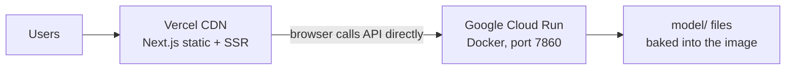

# Architecture

A stateless two-service system: a static-friendly Next.js frontend and a FastAPI inference API with a framework-agnostic model adapter layer. No database — see [DECISIONS/001-no-database.md](DECISIONS/001-no-database.md).

## System overview



## Backend layering

```text
app/
├── main.py            app factory: CORS, error handlers, lifespan model load
├── core/              config (pydantic-settings), logging, typed errors
├── api/               health (unversioned) + api/v1 routers
├── schemas/           public response models + metadata validation
├── services/          model_state, image_validation, preprocessing, prediction_service
└── adapters/          base ABC, mock, tensorflow, registry
```

Rules:
- Routes never touch ML frameworks; only `adapters/` may import TensorFlow, lazily inside `load()`.
- Everything the pipeline does (input size, color mode, normalization, upload limit) comes from `model/metadata.json`, validated by Pydantic.
- Every error leaving the API is `{"error": {"code", "message"}}` with a safe public message.

## Upload & prediction sequence



## Model-loading flow (startup)



Mode is reported by `GET /health` (`real` / `mock` / `unavailable`). The registry raises if `framework=mock` under `APP_ENV=production`.

## Frontend structure

```text
src/
├── app/               layout (fonts, metadata), page, error boundary, globals.css (tokens)
├── components/
│   ├── classifier/    Classifier (state machine), UploadDropzone, ImagePreview,
│   │                  StatusPanel, ResultPanel, ProbabilityList, MockBanner
│   └── sections/      Header, Hero, HowItWorks, ModelInfo, Limitations, PrivacyNotice, Footer
└── lib/               config, types (mirrors API schemas), api-client, validation
```

The classifier is a five-phase state machine: `empty → preview → loading → result | failed`. Service errors keep the preview for retry; file rejections drop it.

## Local development flow



## Deployment topology

See [DEPLOYMENT.md](DEPLOYMENT.md).


