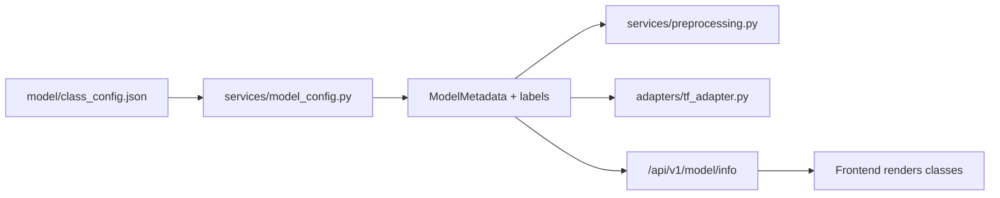

# Model Integration

The deployed model is a **ResNet50V2** fine-tuned for oral image
classification, integrated through the framework-agnostic adapter layer. The
drop-in guide lives in [model/README.md](../model/README.md); this document
explains how the pieces fit.

## The model, as verified from the file

Read directly from `oral_disease_resnet50v2_deployment.keras` (a `.keras` file
is a zip: `metadata.json` + `config.json` + `model.weights.h5`):

| Property | Value |
|---|---|
| Saved with | Keras **3.13.2** |
| Input | `(None, 224, 224, 3)`, float |
| First layers | augmentation `Sequential` (RandomFlip/Rotation/Zoom/Contrast) → **`Rescaling(1/127.5, offset=-1)`** |
| Backbone | `resnet50v2` |
| Head | GlobalAvgPool → BatchNorm → Dropout → Dense(256, relu) → Dropout → **`Dense(6, softmax)`** |

Three facts drive the whole integration:

1. **The model preprocesses its own input.** The internal `Rescaling` maps
   0–255 → [−1, 1]. The service therefore feeds **raw 0–255 float32 RGB**
   (`normalization: "none"`) and never calls `preprocess_input`.
2. **The output is already a probability distribution** (softmax head). The
   adapter never applies a softmax — it *validates* the distribution.
3. **The augmentation layers are training-only.** Inference calls
   `model(batch, training=False)`, which guarantees they are inactive
   (`.predict()` would too, but calling the model directly is faster for single
   images and avoids retracing).

The model's signature is asserted against `class_config.json` at startup: a
mismatch in input shape or class count is a **fatal load error**, not a warning.

## Configuration flow



`class_config.json` is the single source of truth. `pixel_range` is *derived*
into the service's normalization rule:

| `pixel_range` | service normalization | meaning |
|---|---|---|
| `[0, 255]` | `none` | the model rescales internally ← **this model** |
| `[0, 1]` | `0-1` | the service must divide by 255 |
| `[-1, 1]` | `-1-1` | the service must map to [−1, 1] |
| anything else | **rejected** | never guessed at |

The legacy `metadata.json` + `labels.json` format still loads, as a fallback.

## Modes

`MODEL_MODE` (`auto` by default) resolves to one of four reported states:

| `/health` `mode` | Meaning |
|---|---|
| `real` | the trained model is loaded and serving |
| `mock` | the development predictor is serving (never in production) |
| `unavailable` | no model is configured |
| `model_load_failed` | a real model was expected but could not be loaded |

> [!IMPORTANT]
> **A failed real model never silently becomes a mock.** `MODEL_MODE=real` with
> an unloadable model reports `model_load_failed` and serves `503` — even in
> development, where the mock would otherwise be allowed. This is covered by
> `test_real_mode_never_falls_back_to_mock`.

`/health` also returns a short, safe `error_code` (`MODEL_LOAD_FAILED`,
`INVALID_MODEL_CONFIG`, `MOCK_FORBIDDEN_IN_PRODUCTION`, `MODEL_NOT_CONFIGURED`).
It never contains paths, stack traces, or model internals — those go to the
server logs only.

## Inference path

```text
POST /api/v1/predict
  → validate_and_decode()      extension, MIME, size, decode, dimensions
  → run_in_threadpool(...)     keeps the event loop free (~0.6-1.1 s of CPU)
      → preprocess_image()     EXIF → RGB → 224×224 → float32 → (1,224,224,3)
      → TensorFlowAdapter.predict()
            model(batch, training=False)   under a lock (Keras isn't re-entrant)
            validate: length == 6, all finite, sum ≈ 1, no negatives
      → map probabilities onto labels, pick the max
  → PredictionResponse (mock: false)
```

Invalid model output (wrong length, NaN/inf, not a distribution) raises
`ModelOutputError` → a sanitized `500`. It is **never** "fixed" by renormalizing
or applying a softmax, because that would invent a distribution the model did
not produce.

## Resampling note

Training resized with TensorFlow (bilinear by default); the service resizes with
PIL LANCZOS. This is a benign resampling difference, not a correctness bug — the
model receives a correctly-shaped, correctly-ranged 224×224 RGB tensor either
way. It is recorded here so nobody has to rediscover it.

## Dependencies

`apps/api/requirements-tf.txt` pins `tensorflow==2.21.0` and `keras==3.13.2`
(the exact version the model was saved with). The Docker image installs
`tensorflow-cpu` instead — same runtime, ~1 GB smaller, and this service only
ever does CPU inference. No PyTorch, no ONNX.

## Testing

```powershell
pytest                 # fast suite — no TensorFlow needed
pytest -m real_model   # loads the real model + runs every model/samples/ image
```

See [TESTING.md](TESTING.md).
