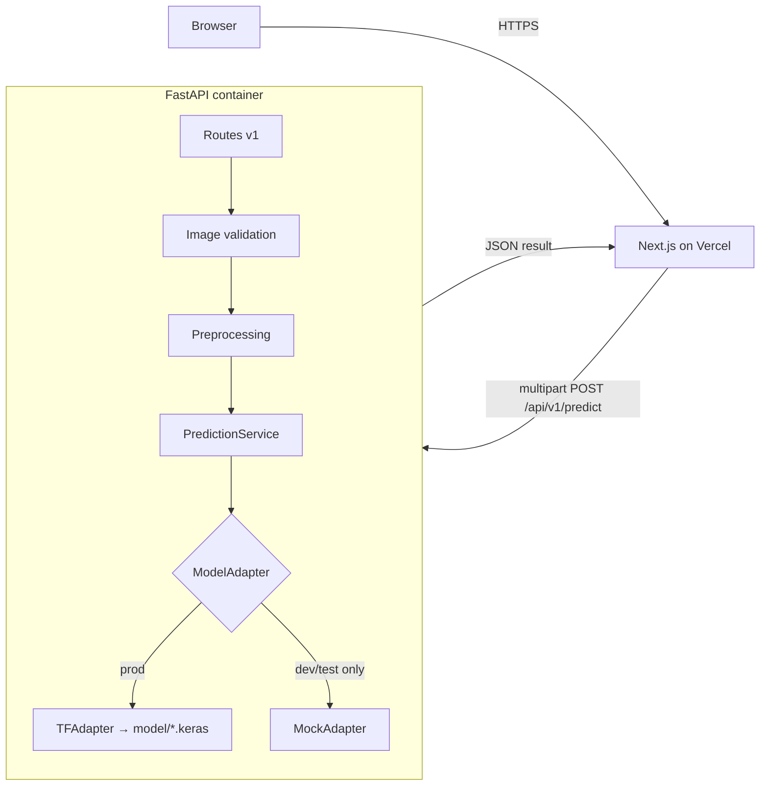

# Oral Disease AI Classifier — Architecture Plan

## Context

Academic project: an oral-disease image classification system. The user personally handles **all ML work** (custom CNN, pretrained models, tuning, evaluation, model selection, export). This plan covers everything else: monorepo architecture, premium frontend, FastAPI backend, a framework-agnostic model integration layer, testing, Docker, deployment configs, docs, and project skills. The final Keras model will be dropped into `model/` later and must integrate **without changing the frontend or public API**.

## 1. Project Understanding

A user uploads an oral/dental image → backend validates it → preprocesses in memory → runs inference through an adapter layer → returns `predicted_class`, `confidence`, `probabilities`, `model_name`, `model_version` → frontend renders the result responsibly (educational disclaimer, never a diagnosis). Until the real model exists, a clearly-labeled **mock mode** powers development and tests; production fails safely without a real model.

## 2. Assumptions (documented, non-blocking)

- **ML framework: TensorFlow/Keras** (user-confirmed). TFAdapter gets the concrete implementation; PyTorch/ONNX adapters are documented stubs.
- **Backend hosting target: Hugging Face Spaces (Docker)** (user-confirmed). Free tier: 2 vCPU / 16 GB RAM — fits TF serving. Render documented briefly as alternative.
- Package manager: **npm** (pnpm not installed; npm 10.9.2 present).
- Python 3.12, Node 22, Next.js 15+ (App Router), Tailwind CSS v4.
- Local `git init` + conventional commits (NO push to GitHub — restricted).
- Class labels unknown → everything label-driven from `model/labels.json`; UI renders N classes dynamically. **No invented classes, metrics, or results anywhere.**
- Docker daemon currently not running — Docker validation phase will ask the user to start Docker Desktop.
- UI language: English.

## 3. Scope Boundaries

**In scope:** monorepo, frontend, backend API, model integration layer, mock mode, tests, docs, Docker, deployment files, skills folder.

> [!danger] Hard restrictions (out of scope)
> Any model building/training/tuning/evaluation, inventing classes/metrics/results, database, auth, deploying, pushing to GitHub, paid resources.

## 4. Functional Requirements

- Upload (drag-drop + click), preview, remove/replace, validate (extension, MIME, size, empty, corrupt, dimensions, decompression bomb, EXIF orientation).
- Analyze with duplicate-submission protection and loading state.
- Result: predicted class, confidence, full probability distribution, model name/version, "analyze another".
- States: invalid file, missing model (503), backend unavailable, generic error.
- Info sections: hero, how-it-works, model info, limitations, privacy, medical disclaimer.
- `GET /health`, `GET /api/v1/model/info`, `POST /api/v1/predict`.

## 5. Non-Functional Requirements

- Privacy: in-memory image processing, no persistence, no image/metadata logging, no trackers.
- Security: strict upload validation, env-driven CORS (never wildcard in prod), safe public errors, secrets in env vars.
- Accessibility: keyboard nav, focus states, semantic HTML, `prefers-reduced-motion`, WCAG AA contrast.
- Responsive: mobile / tablet / desktop.
- Maintainable by one student; TypeScript strict; typed API contract; reproducible lockfiles.

## 6–8. Stack Comparison, Recommendation, Rationale

| Layer | Options | Choice | Why |
|---|---|---|---|
| Frontend | Next.js App Router vs React+Vite | **Next.js 15 App Router + TypeScript strict + Tailwind v4** | First-class Vercel deploy, file-based routing, metadata/SEO, image optimization, portfolio quality. Vite is lighter but gains nothing here since Vercel is the target. |
| Animation | Framer Motion | **Motion (framer-motion), sparingly** | Only for meaningful transitions (result reveal, upload states); respects reduced motion. |
| Backend | FastAPI vs Flask | **FastAPI** | Native Pydantic validation, async, auto OpenAPI docs, typed errors, first-class pytest/httpx testing. Flask needs plugins for all of this. |
| Model runtime | TF / PyTorch / ONNX | **TensorFlow (adapter)** — installed only when real model arrives; mock mode needs zero ML deps | Matches user's export. Adapter interface keeps PyTorch/ONNX possible. |
| Frontend deploy | Vercel | **Vercel** | Free, ideal for Next.js. Model never runs in a Vercel function (too large). |
| Backend deploy | HF Spaces vs Render vs Railway | **HF Spaces (Docker)** | Free 2 vCPU/16 GB fits a TF model; Docker gives full control; health checks supported. Render free tier (512 MB) can't hold TF. |
| Container | Docker | **API Dockerfile + docker-compose for local full-stack** | HF Spaces requirement + reproducibility. |

Deliberately avoided: microservices, Kubernetes, queues, databases, auth — a modular monorepo (npm workspaces for web; api is plain Python) is the right size.

## 9. Repository Structure

```text
oral-disease-ai-classifier/
├── apps/
│   ├── web/                      # Next.js 15 App Router (TS strict, Tailwind v4)
│   │   ├── src/app/              # layout.tsx, page.tsx, error.tsx
│   │   ├── src/components/       # ui/ + classifier/ + sections/
│   │   ├── src/lib/              # api-client.ts, types.ts, validation.ts, config.ts
│   │   └── tests/                # Vitest + RTL
│   └── api/                      # FastAPI (Python 3.12)
│       ├── app/
│       │   ├── main.py           # app factory, CORS, lifespan model loading
│       │   ├── core/             # config.py (pydantic-settings), logging.py, errors.py
│       │   ├── api/v1/           # routes: health.py, model.py, predict.py
│       │   ├── schemas/          # prediction.py, model_info.py, errors.py
│       │   ├── services/         # prediction_service.py, image_validation.py, preprocessing.py
│       │   └── adapters/         # base.py (ABC), mock_adapter.py, tf_adapter.py, registry.py
│       ├── tests/                # pytest + httpx + tiny generated test images
│       ├── requirements.txt      # core deps (no ML frameworks)
│       ├── requirements-tf.txt   # activated when real model arrives
│       └── Dockerfile
├── model/                        # user drops final model here (gitignored)
│   ├── README.md, metadata.example.json, labels.example.json, .gitkeep
├── skills/                       # project skills + README.md + SOURCES.md
├── .claude/                      # settings.json, skills symlink docs (project scope)
├── docs/                         # see §Documentation
├── scripts/                      # dev.ps1 / dev.sh helpers
├── e2e/                          # Playwright tests + config
├── .github/workflows/ci.yml     # lint + typecheck + tests + builds (runs on push later)
├── docker-compose.yml            # api + web for local
├── .env.example, .gitignore, README.md, CLAUDE.md
```

Improvement over the suggested layout: tests live **with each app** (backend pytest discovers locally; web Vitest config stays local) plus a root `e2e/` for Playwright — cleaner than a single root `tests/`.

## 10. Database Decision — **No database**

> [!important] Decision
> No database in v1. Recorded in `docs/DECISIONS/001-no-database.md`.

The flow is stateless: receive → validate → preprocess in memory → predict → respond → discard. Nothing requires persistence; adding one would create medical-image privacy liability (retention, deletion, breach surface) with zero product value. Config lives in env vars; model metadata in `model/metadata.json`. If history/analytics is ever wanted, it can be added behind the service layer without touching the API contract — documented in `docs/DECISIONS/001-no-database.md`.

## 11. System Architecture



## 12. Request & Inference Flow

1. User drops image → client-side pre-validation (type/size) → preview via object URL (revoked on cleanup).
2. Analyze → `POST /api/v1/predict` (multipart), button disabled while in-flight.
3. Backend: extension → MIME sniff (python-magic-free: Pillow verify) → size limit → decode with Pillow (`MAX_IMAGE_PIXELS` guards decompression bombs) → EXIF transpose → resize/normalize per `metadata.json` → adapter `.predict()` → softmax mapped to labels.
4. Response rendered: class, confidence bar, probability distribution, model name/version + disclaimer.
5. Model loads once at startup (FastAPI lifespan). If `APP_ENV=production` and no model → app starts, `/health` reports `model_loaded: false`, `/predict` returns typed `503 MODEL_NOT_AVAILABLE`. Mock adapter refuses to activate in production.

## 13. Model Integration Contract

- `ModelAdapter` (ABC): `load()`, `predict(np.ndarray) -> list[float]`, `is_loaded`, `info`.
- `registry.py` selects adapter from `metadata.json → framework` (`tensorflow` | `mock`; `pytorch`/`onnx` documented stubs).
- `metadata.json` (validated by Pydantic): model_name, model_version, framework, model_path, input_width/height/channels, color_mode, preprocessing, normalization (`0-1` | `-1-1` | `imagenet` | `none`), confidence_threshold, max_upload_mb. Labels in `labels.json` (ordered array matching model output indices).
- Mock adapter: deterministic, labeled `"model_name": "mock-development-model"`, response includes `"mock": true`; frontend shows a visible **“Development mock — not a real result”** banner.
- `model/README.md`: where to place files, how to fill metadata/labels, how to enable `requirements-tf.txt`, how to test the adapter (`pytest tests/adapters`), how to switch off mock mode.

## 14. API Contract (`docs/API_CONTRACT.md`)

- `GET /health` → `{status, model_loaded, mode}`
- `GET /api/v1/model/info` → `{model_name, model_version, framework, classes, input_size, disclaimer}`
- `POST /api/v1/predict` (multipart `file`) → `{predicted_class, confidence, probabilities: {label: float}, model_name, model_version, mock?}`
- Errors (typed envelope `{error: {code, message}}`): 400 INVALID_FILE_TYPE / INVALID_IMAGE / EMPTY_FILE / IMAGE_TOO_LARGE_DIMENSIONS, 413 FILE_TOO_LARGE, 503 MODEL_NOT_AVAILABLE, 500 INTERNAL_ERROR (sanitized).

## 15. Frontend Page & Component Map

Single polished page (App Router) + sections:
- `Hero` → `ClassifierPanel` (the core tool) → `HowItWorks` → `ModelInfo` (fetched from API) → `Limitations` → `PrivacyNotice` → `Footer` (disclaimer).
- Classifier components: `UploadDropzone` (drag/drop + click + keyboard), `ImagePreview` (remove/replace), `AnalyzeButton`, `ResultCard` (class + confidence), `ProbabilityList` (accessible bars), `StateView` (loading / invalid / missing-model / offline / error), `MockBanner`.
- `lib/api-client.ts`: typed fetch wrapper, `NEXT_PUBLIC_API_URL`, discriminated-union result types, timeout + error mapping.

## 16. Design Direction (`docs/DESIGN_SYSTEM.md`)

Personality: **calm clinical confidence** — premium, trustworthy, original; not a SaaS dashboard, not glassmorphism soup. Defined before UI work using the `frontend-design` + `ui-ux-pro-max` skills: typography pairing (distinctive display + readable body), restrained clinical palette with one confident accent, 4px spacing scale, soft elevation, subtle purposeful motion (reduced-motion aware), explicit specs for upload/loading/result/error/missing-model states across desktop/tablet/mobile.

## 17. Security & Privacy Strategy (`docs/SECURITY_AND_PRIVACY.md`)

In-memory processing only; no image persistence; no image/EXIF/path/secret logging (structured sanitized logs); Pillow decompression-bomb + dimension guards; strict multipart validation; env-driven CORS allowlist; safe public error messages; `.gitignore` excludes model files, datasets, uploads, env files, caches; no analytics; documented limitations (no HIPAA claim — educational project).

## 18. Testing Strategy (`docs/TESTING.md`)

- **Backend (pytest + httpx):** health, model info, valid upload (mock), bad extension, bad MIME, oversize, empty, corrupt, huge-dimension, missing model → 503, mock-blocked-in-prod, response contract, preprocessing unit tests. Tiny test images generated in fixtures with Pillow.
- **Frontend (Vitest + Testing Library):** dropzone interactions, validation messages, preview + remove/replace, loading, result render, each error state, object-URL cleanup, a11y roles.
- **E2E (Playwright, root `e2e/`):** happy mock flow, invalid upload, backend down, analyze-another, desktop/tablet/mobile viewports, keyboard-only run, basic a11y assertions. Playwright MCP (already installed) used interactively during development; `@playwright/test` for the committed suite.
- **CI (`.github/workflows/ci.yml`):** ruff + pytest; eslint + tsc + vitest + next build. All checks **actually executed locally** before any completion claim.

## 19. Deployment Strategy (`docs/DEPLOYMENT.md`) — files only, no deploys

- **Web → Vercel:** project config, `NEXT_PUBLIC_API_URL` env docs.
- **API → HF Spaces (Docker):** Dockerfile (python:3.12-slim, non-root, uvicorn, HEALTHCHECK, port 7860), Space README header docs, env vars (`APP_ENV`, `CORS_ORIGINS`, model config), model upload options (bundled vs HF Hub download at build), cold-start and 16 GB RAM notes, safe startup when model missing. Render noted as alternative with RAM caveat.
- **Local:** `docker-compose.yml` (api + web), `scripts/dev.ps1`/`dev.sh` for non-Docker dev.

## 20. Skills Strategy (`skills/` + `.claude/`)

Already installed at user level (verified — will NOT duplicate): superpowers, ui-ux-pro-max, frontend-design, Playwright MCP plugin, context7, github, skill-creator. Recorded in `skills/SOURCES.md` with source/license/status.
Create **4 small project skills** (project `.claude/skills/`, mirrored/documented in `skills/`):
1. `healthcare-ui-review` — clinical tone, responsible wording, disclaimer checks.
2. `upload-prediction-ux` — upload/analyze state-machine conventions for this app.
3. `api-contract-review` — checks frontend types ↔ backend schemas ↔ docs stay in sync.
4. `pre-release-check` — runs the full verification checklist (tests, lint, build, docker).
Wishlist repos (gstack, everything-claude-code, etc.): evaluated during implementation only if a gap appears; nothing cloned blindly; decisions logged in `SOURCES.md`. Project `.claude/settings.json` gets safe permission allowlist.

## 21. Implementation Phases

1. **Scaffold:** git init, monorepo layout, `.gitignore`, `.env.example`, CLAUDE.md, README skeleton, `model/` placeholders.
2. **Backend:** FastAPI app, config, adapters (base/mock/registry + TF adapter behind optional import), validation, preprocessing, routes, errors, logging → full pytest suite green.
3. **Design system:** `docs/DESIGN_SYSTEM.md` via frontend-design + ui-ux-pro-max skills.
4. **Frontend:** Next.js scaffold, tokens, components, API client, all states → Vitest green, `next build` clean, tsc/eslint clean.
5. **E2E + Docker:** Playwright suite (mock backend), Dockerfile + compose (needs Docker Desktop started — will prompt user).
6. **Docs + deployment files + skills:** all `docs/*`, `model/README.md`, HF/Vercel configs, project skills, `skills/SOURCES.md`.
7. **Final verification:** every test/lint/build/docker command re-run and reported honestly.

## 22. Acceptance Criteria

- `docker compose up` (or `scripts/dev`) → working app end-to-end in mock mode with visible mock labeling.
- All backend, frontend, and Playwright tests pass — verified by actual execution.
- `APP_ENV=production` without a model → clean 503 behavior, mock impossible.
- Dropping a real `.keras` + `metadata.json` + `labels.json` into `model/` and installing `requirements-tf.txt` requires **zero frontend/API changes**.
- Keyboard-only flow works; reduced motion respected; responsive at 3 breakpoints.
- No invented medical content anywhere; disclaimers present.

## 23. Risks & Mitigations

| Risk | Mitigation |
|---|---|
| Final model shape/labels unknown | Everything driven by metadata/labels config; contract tested against mock |
| TF image size / RAM on free tier | HF Spaces 16 GB; slim base; TF only in prod requirements |
| Windows dev friction (paths, scripts) | PowerShell + bash script variants; CI on Linux mirrors prod |
| Docker daemon off | Docker phase explicitly asks user to start Docker Desktop |
| Scope creep (DB, auth, dashboards) | Hard restrictions honored; decision log |
| Mock results mistaken for real | Mock flag in API + persistent UI banner + prod lockout |

## 24. Blocking Questions — resolved

- ML framework → **TensorFlow/Keras** (user answered).
- Backend host → **HF Spaces Docker** (user answered).
- Remaining defaults (npm, English UI, local git only) documented as assumptions in §2.

## Verification

Phase-by-phase: `pytest` in `apps/api`; `npm run lint && npm run typecheck && npm test && npm run build` in `apps/web`; `npx playwright test` in `e2e`; `docker compose up --build` + manual smoke of upload→result flow via Playwright MCP; final full re-run before completion is claimed.
